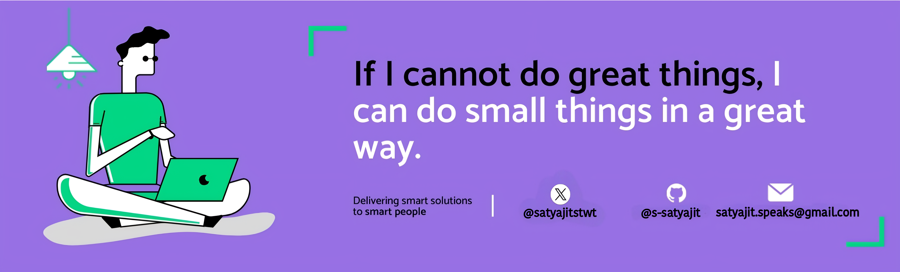

<h1>Hello Fellow  &ltDevelopers/&gt </h1>

<div size="20px">My name is Satyajit Samal. I am an engineering graudate and currently working as a software engineer. I am interested in Web Technologies, Open Source and Problem Solving, thank you for taking the time to view my GitHub Profile</div>

<!-- <div align="center">
  

</div> -->

 <br/>

## 👨🏻‍💻 About Me:


- 💡 **Learning:** Currently building full-stack applications with `React` & `Node.js`, diving deeper into backend technologies like `Express` and `MongoDB`

- 👨‍💻 I’m looking to collaborate for `Dev Projects`

- 🤝 I enjoy working with teams to create meaningful project and solve problems together

- 💻 I also work with `Java` and solve `DSA questions` to improve my problem-solving skills.

- 🤔 I’m looking for help with `Competitive Programming`

- ✨ **Life Hack:** Learn new tech and share what you have learned.

- 🙋‍♂️ Discover more about me at **[My Website](https://satyajitsamal.vercel.app/)**

- ⚡ **Beyond coding:** I love getting lost in adventure novels like [**`The Alchemist`**](<https://en.wikipedia.org/wiki/The_Alchemist_(novel)>)✨ If you share the same taste in books, perhaps we'll meet as book buddies in Bangalore libraries! 📚🤝

<!-- ## 🛠️ My Tech Stack:

### **Languages:**
<h4>🖥️ Mastering core languages for front-end & backend development</h4>
<p>


</p>

### **Frameworks & Libraries:**
<h4>⚡ Building responsive UIs and efficient apps with...</h4>
<p>


</p>

### **Backend (Building While Learning):**
<h4>🚀 Actively building projects on... </h1>
<p>


</p>


### **Tools & Platforms:**
<h4>🔧 Leveraging the best tools for version control, collaboration, and deployment</h4>
<p>


</p>

### **Problem Solving:**
<h4>💡 Solving algorithmic challenges and enhancing my problem-solving skills in Java</h4>
<p>


</p> -->

 <!-- ## 📊 GitHub Stats:

<div align="center">
   <br> <br>

  
  
</div> -->

<!-- ```javascript
import express from "express";
import dotenv from "dotenv";
import helmet from "helmet";
import cors from "cors";
import morgan from "morgan";

dotenv.config();

const PORT    = process.env.PORT ?? 8080;
const SITE    = "https://satyajitsamal.vercel.app/";
const BOOK    = "https://en.wikipedia.org/wiki/The_Alchemist_(novel)";
const NODE_ENV = process.env.NODE_ENV ?? "development";

const app = express();

app.use(helmet());
app.use(cors({ origin: process.env.CORS_ORIGIN || "*" }));
app.use(express.json());
app.use(morgan(NODE_ENV === "production" ? "combined" : "dev"));

class Me {
  pronouns = "He";
  skills = [
    "JavaScript","TypeScript","HTML","CSS","Java",
    "React","Redux","Node.js","Express.js","MongoDB",
    "REST APIs","Git","Postman","Figma","Vercel",
    "Linux","CI/CD"
  ];

  constructor(extra) {
    this.skills = [...this.skills, extra];
  }

  education    = () => "Completed Graduation in B.Tech CSE";
  lookingFor   = () => "Collaborations on Dev Projects";
  passions     = () => ["Open Source","Problem Solving","Teamwork"];
  discoverMore = () => `🙋‍♂️ Discover more about me at ${SITE}`;
  beyondCoding = () =>
    `⚡ Beyond coding: I love getting lost in adventure novels like \`The Alchemist\` (${BOOK}) ✨
     If you share the same taste in books, perhaps we'll meet as book buddies in Bangalore libraries! 📚🤝`;
}

const me = new Proxy(new Me("Algorithms & DSA"), {
  get(target, prop) {
    return typeof target[prop] === "function" ? target[prop]() : target[prop];
  }
});

const router = express.Router();

router
  .get("/me",        (req, res) => res.json(me))
  .get("/me/discover",(req, res) => res.json({ message: me.discoverMore }))
  .get("/me/beyond",  (req, res) => res.json({ message: me.beyondCoding }));

app.use("/api", router);

app.use((req, res) => {
  res.status(404).json({ error: "Not Found" });
});

app.use((err, req, res, next) => {
  console.error(err);
  res
    .status(err.status || 500)
    .json({ error: NODE_ENV === "production" ? "Server Error" : err.message });
});

process.on("SIGTERM", () => {
  console.info("SIGTERM received, shutting down.");
  server.close(() => process.exit(0));
});

const server = app.listen(PORT, () => {
  console.log(`🚀 [${NODE_ENV}] Server listening on http://localhost:${PORT}/api`);
});


``` -->

## ❤️ Let's get connected:

<h3 align="center">Let's collaborate on exciting projects! Feel free to connect with me via:</h4>

<p align="center"><a href="https://satyajitsamal.vercel.app/" target="_blank"></a> <a href="https://x.com/satyajitstwt"></a>
<a href="https://www.linkedin.com/in/satyajitsamal/"></a> <a href="mailto:satyajitsamal.workmail@gmail.com" target="_blank"></a><a href="https://discord.com/users/satyajit_samal" target="_blank"></a>
<br> </br>
 <p align="center">
  
</p>

</p>
